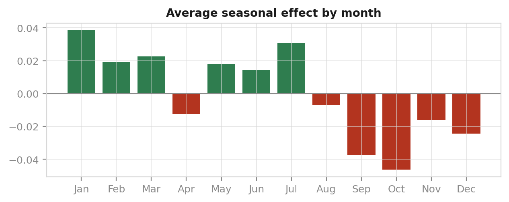
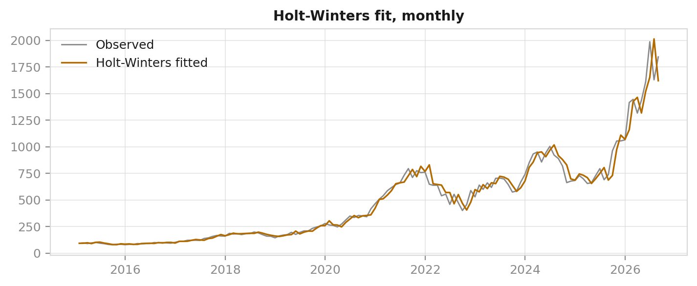
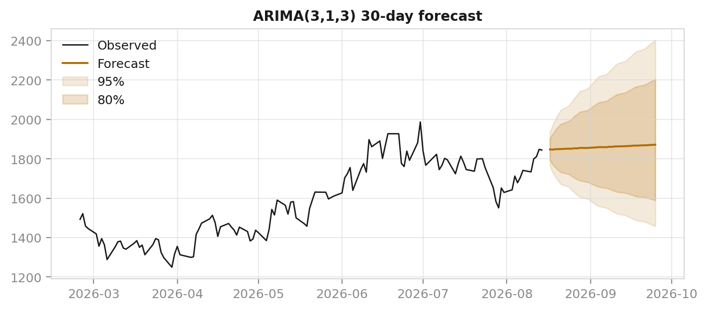
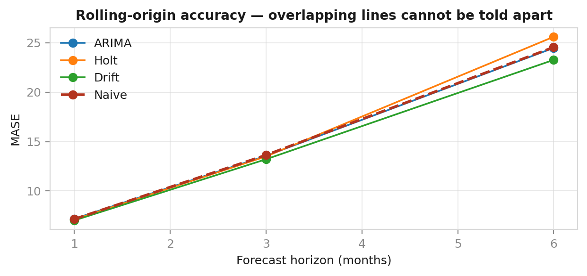

# Abstract

We collect 2,921 daily observations of ASML Holding N.V. (2015-01-02 to 2026-08-14) from Yahoo Finance and apply the Box–Jenkins methodology to determine whether the series can be forecast. Augmented Dickey–Fuller and KPSS agree that the log price is I(1). An AIC search over 16 ARIMA orders selects ARIMA(3,1,3), whose AR and MA roots very nearly cancel. A rolling-origin backtest over 74 origins finds that **no model beats the naive forecast by a statistically significant margin at any horizon**, with every Diebold–Mariano p-value against naive above 0.235. We interpret this as a direct measurement of weak-form market efficiency rather than a modelling failure. Two positive results follow. First, the fitted prediction intervals are badly calibrated, covering 81.5% of outcomes against a nominal 95%, which we trace to the constant-variance assumption that the ARCH-LM test rejects at p < 0.0001. Second, a GARCH(1,1) model shows the *variance* is strongly forecastable, with persistence 0.9864 and a shock half-life of 50.7 trading days. Extending the analysis to seven macro factors reproduces the same conclusion from a different direction: the semiconductor ETF SOXX correlates 0.824 with ASML contemporaneously but only −0.121 at a one-day lead, and a distributed-lag regression explains 67.95% of variance with the same-day term and 1.61% without it.

**Keywords:** Box–Jenkins, ARIMA, exponential smoothing, GARCH, market efficiency, forecast evaluation

---

# 1. Introduction and Objective

The assignment asks us to collect real stock market data, develop an appropriate time series model, and forecast future values. We chose ASML Holding N.V., the Dutch manufacturer that holds an effective monopoly on extreme-ultraviolet lithography and is therefore a structurally important, highly volatile semiconductor equity.

Early in the analysis it became clear that the honest deliverable was not a forecast but a **verdict on forecastability**. We therefore framed the project around the question *"How predictable is ASML?"* and answer it with the tools the course covered. This framing matters: a project that promises forecasts and delivers noise has failed, whereas a project that asks whether forecasting is possible and demonstrates rigorously that it is not has succeeded. The numbers are identical; the scientific claim is not.

**Scope note.** Sections 2–5 use only methods taught in the course (decomposition, ADF/KPSS, ACF/PACF, exponential smoothing, ARIMA, accuracy measures). Sections 6 and 7 are clearly-labelled extension work: GARCH, Black–Scholes and Granger causality were not covered in the labs, and we present them as such.

## 1.1 Data

| Property | Value |
|---|---|
| Ticker | ASML (NASDAQ ADR) |
| Source | Yahoo Finance via `yfinance`, split- and dividend-adjusted |
| Period | 2015-01-02 to 2026-08-14 (11.6 years) |
| Daily observations | 2,921 |
| Monthly observations | 140 |
| First close | 95.94 |
| Last close | 1,844.08 |
| Total return | 1,822.0% |
| CAGR | 28.98% |
| Annualised volatility | 38.01% |

Daily data is used for stationarity testing, ARIMA and volatility work, where sample size drives test power. Monthly data (140 points) is used for seasonal decomposition and exponential smoothing, both of which require a defined seasonal period that daily trading bars do not possess.

---

# 2. Data, Decomposition and Stationarity

*(Abhinabha Das)*

## 2.1 The log transform

ASML compounded at 28.98% annually. Growth of that kind is multiplicative, so its variance grows with its level and violates the constant-variance requirement of every model that follows. Taking logarithms converts multiplicative growth into additive growth and stabilises the variance simultaneously. **All modelling below is performed on the log price**, with results back-transformed to price units for reporting.

Daily log returns are strongly non-normal: skewness −0.3318 and kurtosis **7.8051** against 3.0 for a normal distribution. The fat tails visible in Figure 1 recur in the ARIMA residuals (Section 4) and motivate the Student-*t* error distribution used for GARCH (Section 6).


## 2.2 Classical decomposition

Decomposing the monthly log price into trend, seasonal and remainder components using `seasonal_decompose` with period 12 gives Hyndman strength measures of:

| Component | Strength (0–1) |
|---|---|
| Trend | **0.9905** |
| Seasonal | **0.0980** |


The series is almost purely trend. A seasonal strength of 0.098 means the seasonal panel is fitting noise, not a repeating annual pattern — **there is no calendar season in a share price**, and demonstrating that honestly is a result rather than a disappointment. It sets up a specific prediction for Section 3: the seasonal term in Holt-Winters should earn nothing. Section 3 confirms it, with γ estimated at exactly 0.



## 2.3 Stationarity: ADF and KPSS

The two tests are constructed with opposite null hypotheses, which is precisely why they are used together:

- **ADF** — H₀: the series has a unit root (non-stationary)
- **KPSS** — H₀: the series is stationary

| Series | ADF p | KPSS p | Verdict | Agree? |
|---|---|---|---|---|
| Log price (level) | 0.9634 | 0.0100 | Non-stationary | Yes |
| Δ log price | < 0.0001 | 0.1000 | Stationary | Yes |

On the level, ADF cannot reject a unit root and KPSS rejects stationarity — both point to non-stationarity. After one difference the verdicts invert cleanly. Because the nulls are opposed, this two-way agreement is considerably stronger evidence than either test alone. **ASML log price is I(1), so d = 1.**

## 2.4 Correlogram


For the log price, **all 40** autocorrelations exceed the Bartlett band of ±0.0363, decaying so slowly that lag 40 remains near 1 — the textbook signature of a series with no fixed mean to revert to. For log returns, only **9 of 40** exceed the band, and none is large.

A point of honesty is required here. Ljung-Box on returns at lag 10 gives p < 0.0001, so returns are **not** strictly white noise. With 2,920 observations even an autocorrelation of 0.04 is statistically detectable. The correct reading is that a trace of linear structure exists and is far too small to act on — a distinction that Sections 4 and 5 quantify precisely.

---

# 3. Moving Averages and Exponential Smoothing

*(K Suraj Das)*

## 3.1 Moving averages

Centred moving averages of 3, 6 and 12 months illustrate the bias–variance trade-off directly: MA(3) achieves the lowest RMSE because a short window is permitted to follow the noise, while MA(12) exposes the trend measured at 0.9905 strength in Section 2. Neither forecasts anything — a centred average cannot reach the ends of the sample.

## 3.2 The SES → Holt → Holt-Winters ladder

All three models were fitted on the same training window and evaluated on the same 12-month holdout.

| Model | α | β | γ | Holdout MAPE |
|---|---|---|---|---|
| SES | 0.9879 | — | — | 44.68% |
| Holt | 0.9371 | 0.0000 | — | 39.19% |
| Holt-Winters (add) | 1.0000 | 0.0000 | 0.0000 | 39.60% |



Three parameter estimates carry the entire story:

1. **α ≈ 1** for every model. The level is being reset to whatever just happened, meaning the model is copying the last observation. This is a random walk wearing a costume.
2. **β = 0** exactly. The trend is estimated as fixed for the whole sample, which collapses Holt onto a simple drift model.
3. **γ = 0** exactly. Holt-Winters finds no seasonal pattern to learn — exactly as Section 2's seasonal strength of 0.098 predicted.

## 3.3 Comparison against benchmarks

| Model | Type | MASE | MAPE | Beats naive? |
|---|---|---|---|---|
| SES | model | 21.279 | 44.68% | No |
| Holt | model | 18.625 | 39.19% | Yes |
| Holt-Winters (add) | model | 18.653 | 39.60% | Yes |
| Holt-Winters (mul) | model | 18.709 | 39.81% | Yes |
| Naive | benchmark | 21.248 | 44.61% | — |
| **Drift** | **benchmark** | **18.565** | **39.05%** | **Yes** |
| Seasonal naive | benchmark | 22.081 | 46.68% | No |


**Drift wins.** Last value plus the average monthly change — two parameters, no estimation — ranks first. Holt collapses onto it once β is estimated at 0, and Holt-Winters adds a seasonal term with γ = 0 that changes nothing. The additional machinery buys no accuracy.

*Interpreting MASE correctly.* MASE divides by the **one-step** in-sample naive error, so at a 12-step horizon values well above 1 are expected and are not evidence of failure. What matters is the ranking and the gap to the same-horizon naive figure of 21.248. Equally, a 12-month-ahead MAPE on a stock that tripled says more about the horizon than about any model, which is why Section 4 replaces this single holdout with a rolling-origin evaluation.

---

# 4. ARIMA and Forecast Evaluation

*(Akash Kumar)*

## 4.1 Order selection

With d = 1 fixed by Section 2, we searched all 16 combinations of p, q ∈ {0,1,2,3} by AIC. `pmdarima`'s `auto_arima` is unavailable under NumPy 2, so the grid is explicit — which is in any case more defensible, since every candidate is visible.

| Order | AIC | ΔAIC |
|---|---|---|
| **(3,1,3)** | **−13,539.73** | **0.00** |
| (1,1,3) | −13,520.20 | 19.53 |
| (0,1,3) | −13,515.40 | 24.33 |
| (1,1,0) | −13,515.37 | 24.36 |
| … | … | … |
| (0,1,0) — random walk | −13,502.80 | 36.93 |


The pure random walk ranks **16th of 16**, 36.93 AIC units behind. AIC therefore does detect genuine structure in the differenced series; this is not a case of the criterion being unable to choose.

## 4.2 Estimates, and why they mislead

| Coefficient | Estimate |
|---|---|
| ar.L1 | −0.7897 |
| ar.L2 | 0.8681 |
| ar.L3 | 0.9119 |
| ma.L1 | 0.7384 |
| ma.L2 | −0.8740 |
| ma.L3 | −0.8520 |

All six coefficients are significant at 5%, and estimates of this size look like powerful evidence of structure. They are not. What matters is not the coefficients but the roots of the two polynomials they define:

| | Root moduli |
|---|---|
| AR(3) | 1.0026, 1.0458, 1.0458 |
| MA(3) | 1.0035, 1.0815, 1.0815 |

Every root lies outside the unit circle, so the model is stationary and invertible — but only barely, and that is the point. The smallest AR root and the smallest MA root are **1.0026 and 1.0035**: they sit almost exactly on top of one another, and both sit almost exactly *on* the unit circle. A root at 1 on the AR side is a unit root; a matching root at 1 on the MA side cancels it. The two polynomials therefore share a **near-common factor very close to (1 − L)** — and a factor that appears on both sides of the equation does no forecasting work at all. Six large, individually significant coefficients are spending themselves on a matched pair that annihilates, and what survives is a process barely distinguishable from the random walk we already differenced away.

This is the most important caveat in the report. **A model can carry large, individually significant coefficients and still describe a process barely distinguishable from a random walk.** Reading the coefficient table alone would give exactly the opposite impression; reading the roots gives it away immediately, and only an out-of-sample test can settle it.



The forecast is nearly flat, as a near-random-walk implies. Its honest content is its *width*, not its path.

## 4.3 Residual diagnostics — and a trap worth documenting

`statsmodels` initialises its state-space filter from a diffuse prior, so the first residual is not a model error but the filter finding its footing. On this series that residual is **4.5638** against a residual standard deviation of **0.0237** — a **192.2-sigma** observation.

Left in, it dominates every sum of squares that follows and Ljung-Box reports **p = 0.99999**: apparently flawless white noise. After trimming, the same test reports **p = 0.0961** — an order of magnitude from a rejection rather than a hair's breadth from certainty. **The entire appearance of a perfect fit rested on a single observation**, and nothing in the output looks wrong when it happens. Every diagnostic in this project routes through one shared trimming helper for that reason.

With burn-in excluded:

| Test | p-value | Conclusion |
|---|---|---|
| Ljung-Box (10) | 0.0961 | No autocorrelation left at 5% |
| Jarque-Bera | < 0.0001 | Not normal (kurtosis 7.2615) |
| ARCH-LM (10) | < 0.0001 | Variance is not constant |
| Ljung-Box on squared residuals | < 0.0001 | Variance has memory |


The mean model is clean: with burn-in excluded the residuals pass the white-noise test at 5%, which is what a correctly specified ARIMA should deliver. The remaining three results are not defects in it but **findings** about the data — fat tails and clustered variance are what daily equity returns genuinely look like, and the ARCH result is the direct motivation for Section 6. Note what this combination means: the model has extracted all the *linear* structure there was to extract, and the backtest below still cannot beat a naive forecast with it.

## 4.4 Rolling-origin backtest

A single holdout is one draw. We refit at **74** successive origins with an expanding window and scored every model at horizons of 1, 3 and 6 months.

| Model | h=1 MASE | h=3 MASE | h=6 MASE |
|---|---|---|---|
| ARIMA(3,1,3) | 7.179 | 13.558 | 24.483 |
| Holt | 7.114 | 13.498 | 25.612 |
| Naive | 7.151 | 13.634 | 24.556 |
| **Drift** | **7.020** | **13.211** | **23.273** |

Diebold–Mariano p-values against naive (Newey–West corrected for the overlap that multi-step forecasts create):

| Model | h=1 | h=3 | h=6 |
|---|---|---|---|
| ARIMA | 0.634 | 0.307 | 0.235 |
| Holt | 0.880 | 0.888 | 0.722 |
| Drift | 0.507 | 0.582 | 0.603 |



**Not one p-value falls below 0.05.** Drift ranks first at every horizon, but a ranking without a significant margin is not a win — and reporting it as one would be the single easiest error to make in this project. The Diebold–Mariano test exists precisely to prevent it.

## 4.5 Prediction interval coverage

| Horizon | Empirical coverage | Nominal |
|---|---|---|
| h = 1 | 82.4% | 95% |
| h = 3 | 82.4% | 95% |
| h = 6 | 79.7% | 95% |

Mean coverage is **81.5%** against a nominal 95%. The intervals are **too narrow** — the model systematically understates risk. The cause is identified in Section 4.3: ARIMA assumes one constant error variance while ARCH-LM rejects that assumption outright. Averaging volatility across calm and turbulent regimes understates risk in exactly the periods where it matters most.

We report this deliberately. It is the honest limitation of the model we actually fitted, and it is the gap Section 6 exists to close.

---

# 5. Discussion: Interpreting a Null Result

Four independent lines of evidence, drawn from four different labs, converge:

1. ADF and KPSS agree the log price is I(1) (§2.3).
2. The ACF of returns collapses immediately, with the largest autocorrelation far below any tradeable size (§2.4).
3. The selected ARIMA's AR and MA roots nearly cancel, describing a near-random walk (§4.2).
4. No model beats naive out of sample at any horizon, DM p ≥ 0.235 (§4.4).

Convergent evidence of this kind is a stronger empirical argument than any single model with a flattering error metric. It is also a textbook result: this is the empirical content of **weak-form market efficiency** (Fama, 1970). If past prices contained exploitable information, trading activity would already have removed it. Our inability to beat a naive forecast is a confirmation of established theory measured on data we collected ourselves, not a failure of method.

The failure mode we deliberately avoided was tuning horizons, orders and windows until something appeared to win. Given enough specifications, one will win by chance; the Diebold–Mariano test is what distinguishes that from a real effect.

---

# 6. Extension: Volatility and Option Pricing

*(Ritesh KR)* — **beyond the course syllabus**

## 6.1 GARCH(1,1)

Section 4 left two loose ends pointing the same way: ARCH-LM rejected constant variance, and the prediction intervals covered 81.5% instead of 95%. GARCH(1,1) addresses both by letting today's variance depend on yesterday's shock and yesterday's variance, with Student-*t* errors to accommodate kurtosis of 7.8.

$$\sigma_t^2 = \omega + \alpha \varepsilon_{t-1}^2 + \beta \sigma_{t-1}^2$$

| Parameter | Estimate |
|---|---|
| α (shock) | 0.0752 |
| β (persistence) | 0.9113 |
| α + β | **0.9864** |
| Half-life | **50.7 trading days** |
| Current annualised volatility | 45.3% |
| Long-run annualised volatility | 42.7% |


Persistence of 0.9864 means a volatility shock is still half-present roughly 50 trading days later. Ljung-Box on the squared standardised residuals returns p = 0.2012, so the model has fully absorbed the ARCH effect that ARIMA left behind.

**This is the project's central contrast: the direction of ASML is unforecastable, but the magnitude of its moves is strongly forecastable.**

## 6.2 Black–Scholes against a live market

We priced 61 near-the-money calls expiring 2026-09-18 using the GARCH volatility of 45.3% and a risk-free rate of 3.697% (13-week T-bill).

| Quantity | Value |
|---|---|
| Spot | 1,844.08 |
| ATM strike | 1,840.00 |
| Market mid | 102.85 |
| Black–Scholes price | 105.09 |
| Difference | +2.2% |
| Mean implied volatility | 49.2% |
| GARCH volatility | 45.3% |
| Gap | **+3.9 points** |


The market prices 3.9 volatility points above what history alone justifies — the standard interpretation being a variance risk premium plus event risk inside the expiry. More revealing is the **smile**: Black–Scholes assumes a single volatility for every strike, yet implied volatility curves visibly across moneyness. Both departures trace to the same wrong assumption — constant Gaussian volatility — that Section 4's ARCH test and residual kurtosis of 7.2615 had already rejected.

---

# 7. Extension: Macro-Factor Lag Analysis

*(Aditya Mehta)* — **beyond the course syllabus**

If ASML cannot predict itself, can anything else? We tested seven factors over 2,915 common trading days.

## 7.1 Cross-correlation

| Factor | Same day (lag 0) | Best lead (lag +1) | Ratio |
|---|---|---|---|
| SOXX (semiconductor ETF) | **0.8237** | −0.1210 | 0.15 |
| TSM (customer) | 0.6780 | −0.0836 | 0.12 |
| ^GSPC (S&P 500) | 0.6728 | −0.1466 | 0.22 |
| NVDA | 0.6304 | −0.0724 | 0.11 |
| ^VIX | −0.5253 | 0.0690 | 0.13 |
| ^TNX (10Y yield) | 0.0801 | −0.0822 | 1.03 |
| EURUSD=X | 0.0068 | −0.0445 | 6.54 |


Every factor shows the same shape: a tall spike at lag 0 and near-flat ground on either side. **Not one factor carries a usable lead.** Note also that the lag-1 correlations are *negative* — the opposite sign to the same-day relationship. That is the signature of short-horizon reversal and bid-ask bounce, not of a predictive link; a factor genuinely leading ASML would carry the same sign it has at lag 0.

## 7.2 Distributed-lag regression

Regressing ASML returns on SOXX and five of its lags:

| Specification | R² |
|---|---|
| Including the same-day term | **0.6795** |
| Lags only (what a forecaster could use) | **0.0161** |


The lag-0 coefficient is 0.9381 and dwarfs every lagged term. **Removing the one variable a forecaster cannot know in advance destroys 97.6% of the explanatory power.** High correlation and zero predictability coexist comfortably, and that is the most useful thing this section has to say.

## 7.3 Granger causality

Testing lags 1–5 per factor with a Bonferroni-corrected threshold of α = 0.01:

**Four factors are Granger-significant: SOXX, TSM, ^GSPC and ^TNX.**

We report this plainly rather than suppressing it, because it appears to cut against the section's conclusion. It does not, for two reasons. First, significance and usefulness are different questions: across 2,915 observations a test will detect an effect explaining well under 1% of variance, which is exactly what §7.2 measures directly. Second, Section 4 already demonstrated what becomes of small in-sample effects when taken out of sample. The honest summary is that these factors carry a **statistically real but economically negligible** lead.

Granger causality is also a claim about forecast improvement, not about cause. The test cannot distinguish whether a factor drives ASML, responds to it, or shares a common driver with it — and for a chip-equipment maker and a semiconductor index, the third is by far the most plausible.

---

# 8. Limitations

1. **Single asset, single regime.** Conclusions are specific to ASML over 2015–2026, a period dominated by one extraordinary bull run.
2. **Linear models only.** ARIMA and exponential smoothing capture linear dependence. A non-linear or regime-switching relationship would be invisible to every test used here.
3. **SARIMA was not fitted.** The course covered it only as a next step, and Section 2 measured seasonal strength at 0.098, so a seasonal ARIMA was not justified. It remains the natural extension.
4. **Daily closes ignore microstructure.** Bid-ask bounce plausibly explains the negative lag-1 correlations in §7.1; intraday data would be needed to confirm this.
5. **Live option chain.** Section 6.2 reflects quotes at one moment; liquidity varies by strike and stale quotes can distort implied volatilities in the wings.
6. **No transaction costs.** Even had a model beaten naive, costs were not modelled, so no claim about tradeable profit could follow.

---

# 9. Conclusion

Applying the Box–Jenkins methodology to 2,921 daily observations of ASML, we find the log price is I(1); that an AIC-selected ARIMA(3,1,3) carries six significant coefficients whose AR and MA roots nearly cancel; and that across 74 rolling origins **no model beats the naive forecast by a statistically significant margin at any horizon**. Four independent lines of evidence converge on the same conclusion, which we identify as weak-form market efficiency rather than a modelling failure.

Two findings extend beyond that null result. The fitted prediction intervals are materially miscalibrated at 81.5% empirical coverage against 95% nominal, and the cause is the constant-variance assumption that ARCH-LM rejects. Modelling the variance directly with GARCH(1,1) yields persistence of 0.9864 and a 50.7-day shock half-life, fully absorbing the ARCH effect. The practical summary is the one we would defend in a viva: **we cannot say where ASML is going, but we can say — with a well-specified model — how rough the journey will be.**

---

# References

Box, G. E. P., & Jenkins, G. M. (1970). *Time Series Analysis: Forecasting and Control*. Holden-Day.

Bollerslev, T. (1986). Generalized autoregressive conditional heteroskedasticity. *Journal of Econometrics*, 31(3), 307–327.

Black, F., & Scholes, M. (1973). The pricing of options and corporate liabilities. *Journal of Political Economy*, 81(3), 637–654.

Diebold, F. X., & Mariano, R. S. (1995). Comparing predictive accuracy. *Journal of Business & Economic Statistics*, 13(3), 253–263.

Engle, R. F. (1982). Autoregressive conditional heteroscedasticity with estimates of the variance of United Kingdom inflation. *Econometrica*, 50(4), 987–1007.

Fama, E. F. (1970). Efficient capital markets: A review of theory and empirical work. *The Journal of Finance*, 25(2), 383–417.

Granger, C. W. J. (1969). Investigating causal relations by econometric models and cross-spectral methods. *Econometrica*, 37(3), 424–438.

Hyndman, R. J., & Athanasopoulos, G. (2021). *Forecasting: Principles and Practice* (3rd ed.). OTexts.

Kwiatkowski, D., Phillips, P. C. B., Schmidt, P., & Shin, Y. (1992). Testing the null hypothesis of stationarity against the alternative of a unit root. *Journal of Econometrics*, 54(1–3), 159–178.

---

# Appendix: Reproducibility

Every figure and every number in this report is generated by `docs/figures/make_figures.py`, which imports the same backend modules that serve the dashboard. There is one implementation, so a figure in this PDF cannot disagree with the application.

```bash
pip install -r backend/requirements.txt
python docs/figures/make_figures.py       # figures + facts.json
pytest backend/test_backend.py            # 55 assertions, including the burn-in guard
python -m uvicorn main:app --port 8000    # from backend/
npm run dev                               # dashboard at :5173
```

Because the data is fetched live, re-running after a market move will shift the final digits. The structural conclusions — I(1), near-cancelling roots, no significant edge over naive, high GARCH persistence — are stable across refreshes. `backend/test_backend.py` asserts them, so if a future refresh ever overturns the headline result, the test suite fails and this report needs rewriting rather than the test.
