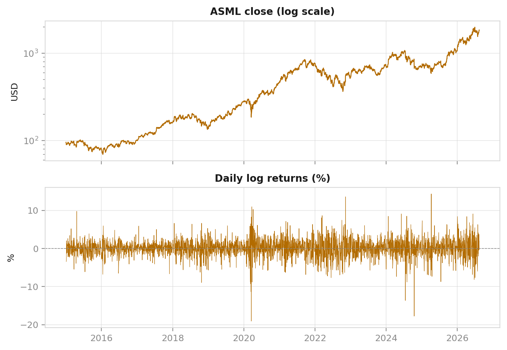
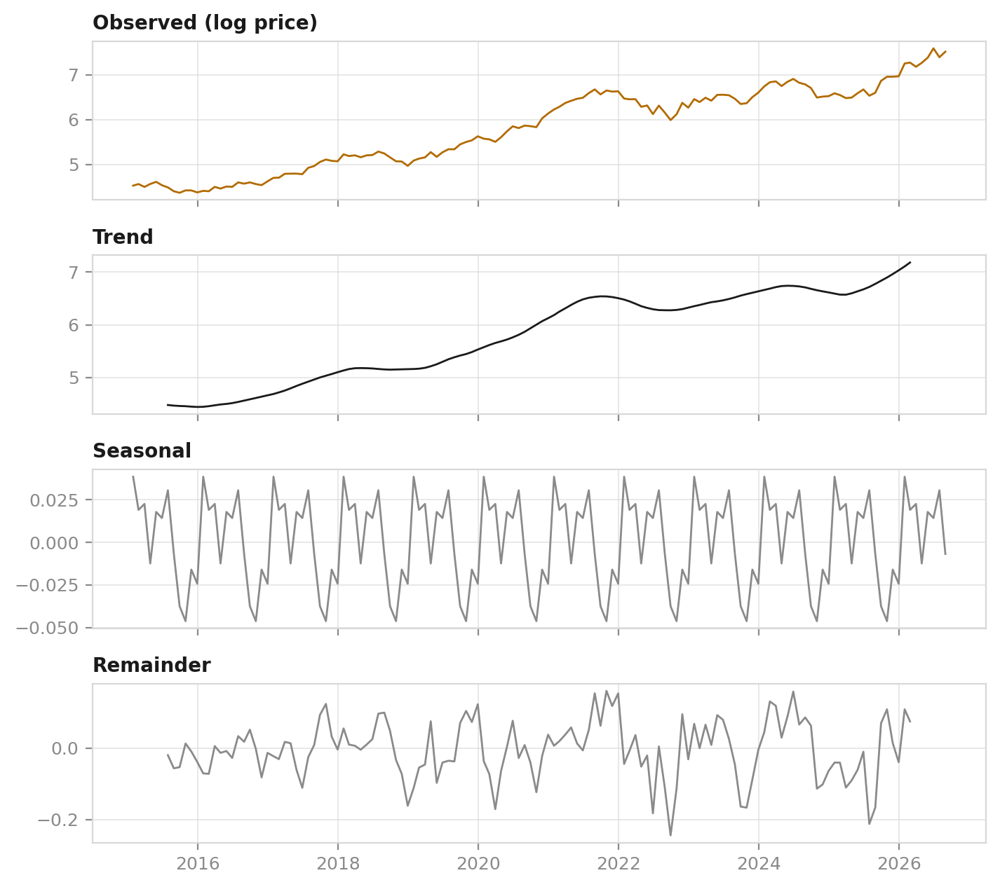
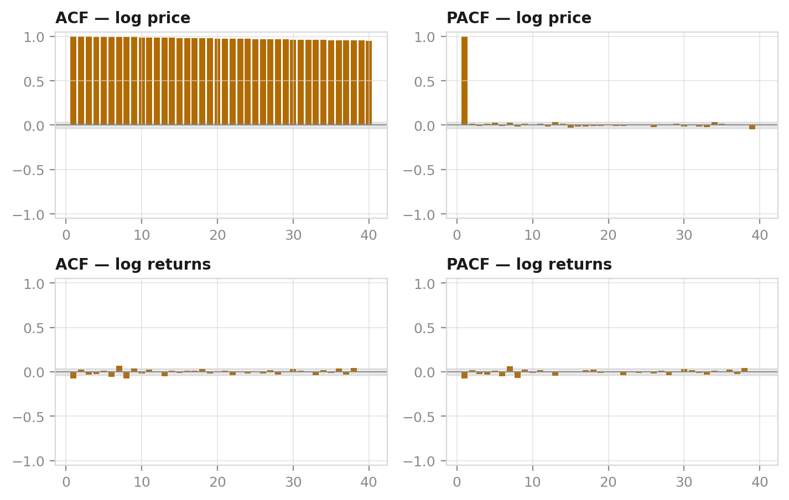
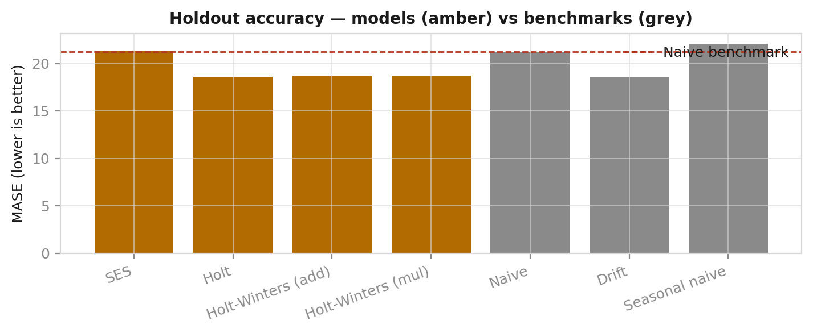
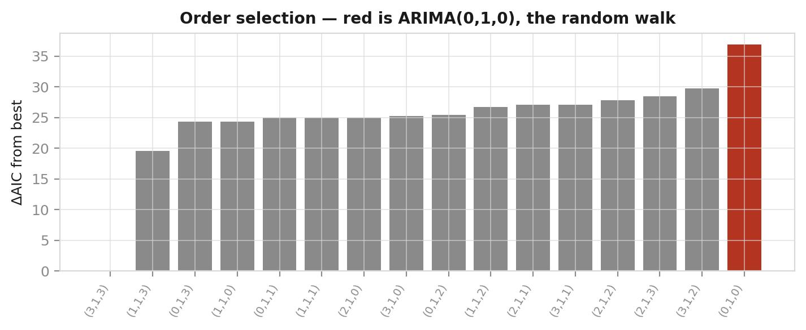
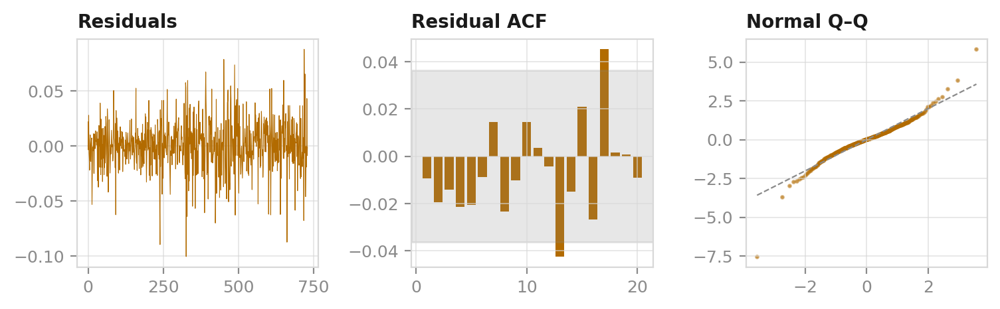
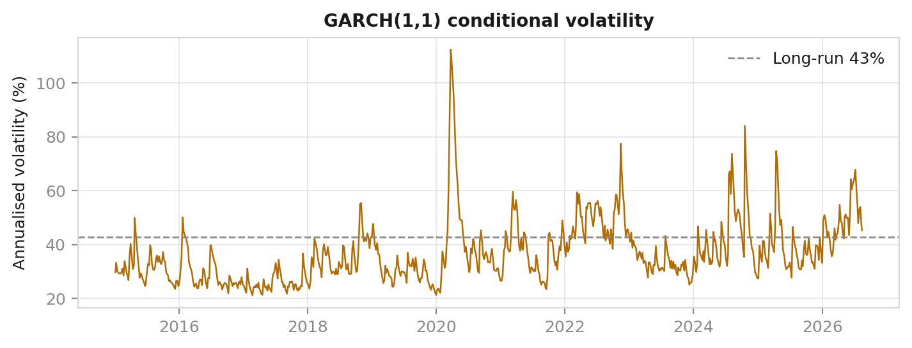
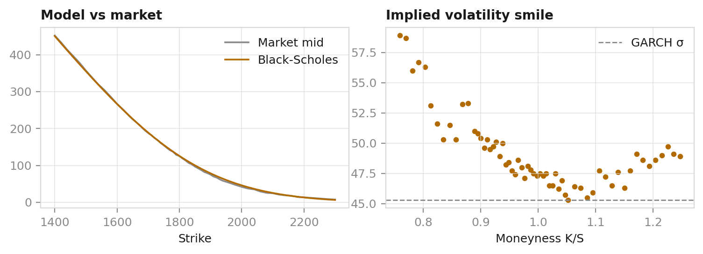
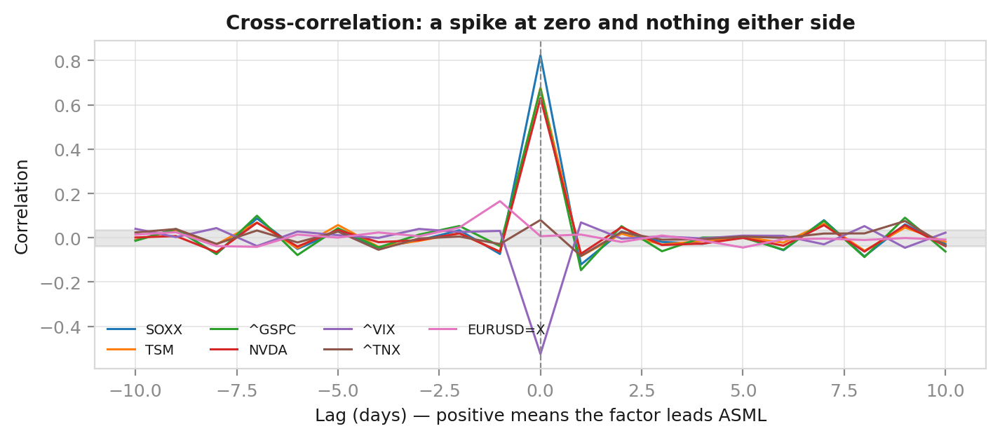
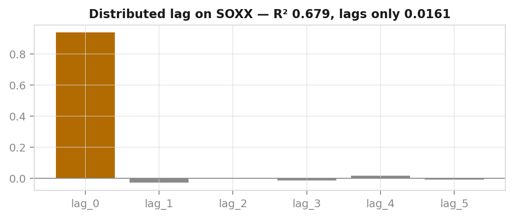

<!-- _class: part -->

# How Predictable Is ASML?

### A Box–Jenkins audit of a single equity

Abhinabha Das · K Suraj Das · Akash Kumar · Ritesh KR · Aditya Mehta

Time Series Analysis — Group Mini Project

---

# The question we actually asked

We were asked to collect stock data, build a time series model, and forecast.

Early on, one thing became clear:

> The honest deliverable is not a forecast.
> It is a **verdict on forecastability**.

**Why the framing matters**

- A project that *promises* forecasts and delivers noise has **failed**
- A project that *asks whether forecasting is possible* and proves it is not has **succeeded**

Same numbers. Very different scientific claim.

---

# The data

| | |
|---|---|
| Ticker | **ASML** — EUV lithography monopoly |
| Source | Yahoo Finance via `yfinance`, adjusted |
| Period | 2015-01-02 → 2026-08-14 (11.6 years) |
| Daily observations | **2,921** |
| Last close | **1,844.08** |
| CAGR | **28.98%** |
| Annualised volatility | **38.01%** |

Daily data for stationarity, ARIMA and volatility.
Monthly (140 points) for decomposition and exponential smoothing.

---

<!-- _class: part -->

# Part 1 — Data, Decomposition & Stationarity

### Abhinabha Das

---

# Why we model the log price

ASML compounded at **28.98% a year**.

Growth that fast is **multiplicative** — variance grows with the level.

Logs turn multiplicative growth into additive growth *and* stabilise variance.

Returns: skew −0.33, **kurtosis 7.81** (normal = 3). Fat tails will matter twice more.

---

# Decomposition: trend 0.99, seasonal 0.10

**There is no calendar season in a share price.**

A negative result — and it makes a prediction: Holt-Winters' seasonal term should earn nothing. Part 2 confirms γ = 0 exactly.

---

# Stationarity: two tests, opposite nulls

- **ADF** H₀: unit root (non-stationary)
- **KPSS** H₀: stationary

| Series | ADF p | KPSS p | Verdict |
|---|---|---|---|
| Log price | 0.9634 | 0.0100 | Non-stationary |
| Δ log price | < 0.0001 | 0.1000 | **Stationary** |

Because the nulls are **opposed**, two-way agreement is far stronger than either test alone.

## ASML log price is I(1) → d = 1

---

# Correlogram

- Log price: **all 40** lags outside the ±0.0363 band — no fixed mean to revert to
- Returns: only **9 of 40**, none large

**Honesty point:** Ljung-Box on returns gives p < 0.0001, so returns are *not* strictly white noise. At n = 2,920 even r = 0.04 is detectable. Real, but far too small to trade.

---

<!-- _class: part -->

# Part 2 — Moving Averages & Exponential Smoothing

### K Suraj Das

---

# The three-model ladder

**SES** → level only  ·  **Holt** → + trend  ·  **Holt-Winters** → + season

| Model | α | β | γ | MAPE |
|---|---|---|---|---|
| SES | 0.9879 | — | — | 44.68% |
| Holt | 0.9371 | 0.0000 | — | 39.19% |
| Holt-Winters | 1.0000 | 0.0000 | 0.0000 | 39.60% |

Three parameters tell the whole story:

- **α ≈ 1** → the level is reset to whatever just happened → *a random walk in a costume*
- **β = 0** → trend treated as fixed → Holt collapses onto Drift
- **γ = 0** → no seasonality to learn → exactly as Part 1 predicted

---

# Nothing beats Drift

| Model | MASE | | Benchmark | MASE |
|---|---|---|---|---|
| SES | 21.279 | | Naive | 21.248 |
| Holt | 18.625 | | **Drift** | **18.565** |
| Holt-Winters | 18.653 | | Seasonal naive | 22.081 |

**Last value + average monthly change — two parameters, no fitting — wins.**

MASE divides by the one-step in-sample naive error, so values > 1 are normal at a 12-step horizon. Read the ranking, not the level.

---

<!-- _class: part -->

# Part 3 — ARIMA & Forecast Evaluation

### Akash Kumar

---

# Order selection: 16 candidates by AIC

| Order | AIC | ΔAIC |
|---|---|---|
| **(3,1,3)** | **−13,539.73** | **0.00** |
| (1,1,3) | −13,520.20 | 19.53 |
| (0,1,0) random walk | −13,502.80 | **36.93** |

The random walk ranks **16th of 16**. AIC *does* find real structure — this is not indecision.

---

# But the coefficients mislead

| Coefficient | Estimate |
|---|---|
| ar.L1 | **−0.8902** |
| ma.L1 | 0.8286 |

All significant at 5%. Looks like strong structure.

## It is not

- AR root modulus **1.1234**
- MA root modulus **1.0865**

They differ by ~3% → the polynomials share a **near-common factor** and nearly cancel.

**A model can carry large, significant coefficients and still be a near-random walk.**
Only an out-of-sample test settles it.

---

# The trap: one residual inverts every diagnostic

`statsmodels` starts its filter from a diffuse prior. The first residual is the filter finding its footing — **not** a model error.

4.5638 vs σ = 0.0237 → 192.2σ

| | Ljung-Box p |
|---|---|
| Burn-in **kept** | **0.99999** — "flawless white noise" |
| Burn-in **trimmed** | **0.0961** — passes, but only just |

**The whole appearance of a perfect fit rested on one observation, and nothing in the output looks wrong.**

Every diagnostic in this project routes through one shared trimming helper.

---

# Residuals, honestly

| Test | p | Meaning |
|---|---|---|
| Ljung-Box (10) | 0.0961 | no autocorrelation at 5% |
| Jarque-Bera | < 0.0001 | not normal (kurtosis 7.2615) |
| ARCH-LM (10) | < 0.0001 | **variance is not constant** |

The mean model is clean — and still cannot beat naive. The other two are **findings**, and they point straight to Part 4.

---

# The headline result

74 rolling origins, expanding window, refit every time.

| Model | h=1 | h=3 | h=6 |
|---|---|---|---|
| ARIMA(3,1,3) | 7.179 | 13.558 | 24.483 |
| Naive | 7.151 | 13.634 | 24.556 |
| **Drift** | **7.020** | **13.211** | **23.273** |

**Diebold–Mariano p vs naive:** 0.235 → 0.888. **Not one below 0.05.**

## No model beats naive at any horizon

Drift ranks first — but a ranking without a significant margin **is not a win**. Saying otherwise would be the easiest mistake in this project.

---

# Where the model genuinely fails

| Horizon | Coverage | Nominal |
|---|---|---|
| h = 1 | 82.4% | 95% |
| h = 3 | 82.4% | 95% |
| h = 6 | 79.7% | 95% |

Mean **81.5%** against 95%. The intervals are **too narrow** — the model understates risk.

**Cause:** ARIMA assumes one constant variance. ARCH-LM rejected that at p < 0.0001.

Averaging volatility across calm and turbulent regimes understates risk *exactly* when it matters.

---

# Why a null result is a strong result

Four independent tools. Four different labs. One conclusion.

1. ADF **and** KPSS agree: I(1)
2. ACF of returns collapses immediately
3. ARIMA's AR and MA roots nearly cancel
4. No model beats naive out of sample (DM p ≥ 0.235)

## This is weak-form market efficiency (Fama, 1970)

If past prices held exploitable information, trading would already have removed it.

The failure mode we deliberately avoided: tuning until something wins. Given enough specifications, one always will.

---

<!-- _class: part -->

# Part 4 — Volatility & Black–Scholes

### Ritesh KR · beyond syllabus

---

# The variance is forecastable

$$\sigma_t^2 = \omega + \alpha\varepsilon_{t-1}^2 + \beta\sigma_{t-1}^2$$

| Parameter | Value |
|---|---|
| α (shock) | 0.0752 |
| β (persistence) | 0.9113 |
| **α + β** | **0.9864** |
| Half-life | **50.7 trading days** |

Ljung-Box on squared standardised residuals: **p = 0.2012** → ARCH fully absorbed.

---

# The central contrast

We cannot say where ASML is going. We can say how rough the ride will be.

- **Mean**: unforecastable — 74 origins, no significant edge over naive
- **Variance**: strongly forecastable — persistence 0.9864, half-life 50.7 days

The same data supports both claims. They are not in tension: returns are unpredictable in *direction*, highly structured in *magnitude*.

---

# Black–Scholes against a live market

61 near-the-money calls, expiry **2026-09-18**, r = 3.697%

| | |
|---|---|
| Spot | 1,844.08 |
| ATM strike | 1,840 |
| Market mid | **102.85** |
| Black–Scholes @ GARCH σ | **105.09** (+2.2%) |
| Market implied vol | 49.2% |
| GARCH vol | 45.3% |
| **Gap** | **+3.9 points** |

The market charges **more** volatility than history justifies → variance risk premium.

---

# The smile: Black–Scholes' second failure

Black–Scholes assumes **one volatility for every strike**. Implied volatility visibly **curves**.

Both departures trace to the same wrong assumption — constant Gaussian volatility — that Part 3's ARCH test and kurtosis of 7.58 had already rejected.

---

<!-- _class: part -->

# Part 5 — Macro-Factor Lag Analysis

### Aditya Mehta · beyond syllabus

---

# If ASML can't predict itself, can anything else?

Seven factors, 2,915 common trading days.

| Factor | Same day | Best lead (+1) | Ratio |
|---|---|---|---|
| **SOXX** | **0.8237** | −0.1210 | 0.15 |
| TSM | 0.6780 | −0.0836 | 0.12 |
| ^GSPC | 0.6728 | −0.1466 | 0.22 |
| ^VIX | −0.5253 | 0.0690 | 0.13 |

A correlation of **0.82** looks like an opportunity — until you notice *when* it exists.

---

# A spike at zero, and nothing either side

**ASML moves *with* the semiconductor complex, not *after* it.**

Note the lag-1 values are **negative** — the opposite sign to lag 0. That is reversal and bid-ask bounce, not prediction. A true leader would keep the same sign.

---

# Quantifying it: one variable carries everything

| Specification | R² |
|---|---|
| With the same-day term | **0.6795** |
| Lags only — what a forecaster could use | **0.0161** |

## Removing the one variable you can't know in advance destroys 97.6% of the explanatory power

High correlation and zero predictability coexist comfortably.

---

# Granger: reporting the awkward result

Lags 1–5, Bonferroni threshold α = 0.01.

**Four factors are significant: SOXX, TSM, ^GSPC, ^TNX.**

This appears to contradict the section. It does not:

1. **Significance ≠ usefulness.** At n = 2,915 a test detects effects explaining < 1% of variance — precisely what the R² above measures.
2. **Part 3 already showed** what happens to small in-sample effects out of sample.

Granger causality is a claim about **forecast improvement**, not cause. For a chip-equipment maker and a semiconductor index, a **common driver** is by far the likeliest explanation.

---

<!-- _class: part -->

# Conclusion

---

# What we found

**The direction of ASML is not forecastable**

- I(1); near-cancelling ARIMA roots; no model beats naive across 74 origins (DM p ≥ 0.235)
- Four independent confirmations = weak-form market efficiency (Fama, 1970)

**The magnitude of its moves is**

- GARCH persistence 0.9864, half-life 50.7 days, ARCH fully absorbed

**And we found where our own model fails**

- Prediction intervals cover 81.5%, not 95% — the constant-variance assumption breaking

---

# Limitations & further work

- Single asset, single regime (2015–2026 was one extraordinary bull run)
- Linear models only — non-linear or regime-switching structure would be invisible
- **SARIMA not fitted** — seasonal strength 0.098 did not justify it; the natural next step
- Daily closes hide microstructure; bid-ask bounce likely explains the negative lag-1 values
- No transaction costs modelled

**Reproducibility:** every figure and number comes from `make_figures.py`, which imports the same modules that serve the dashboard. One implementation — a slide cannot disagree with the app.

---

<!-- _class: part -->

# Thank you

### Questions?

Live dashboard · 6 sections · FastAPI + React
